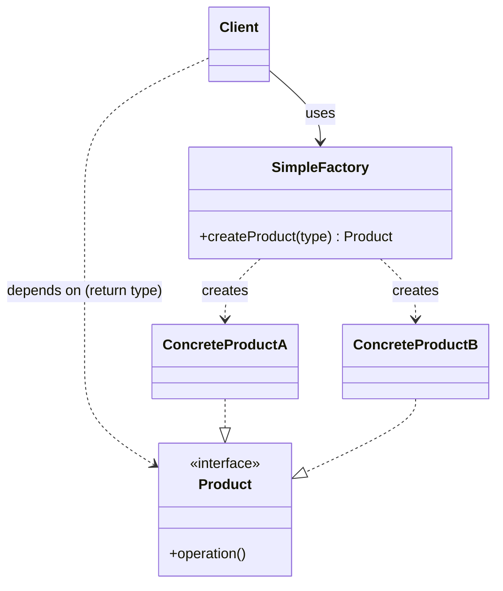
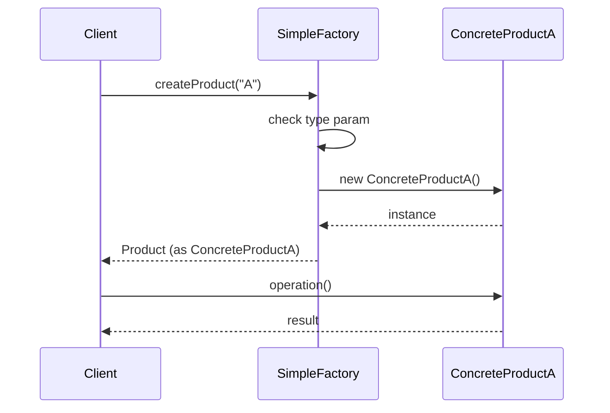
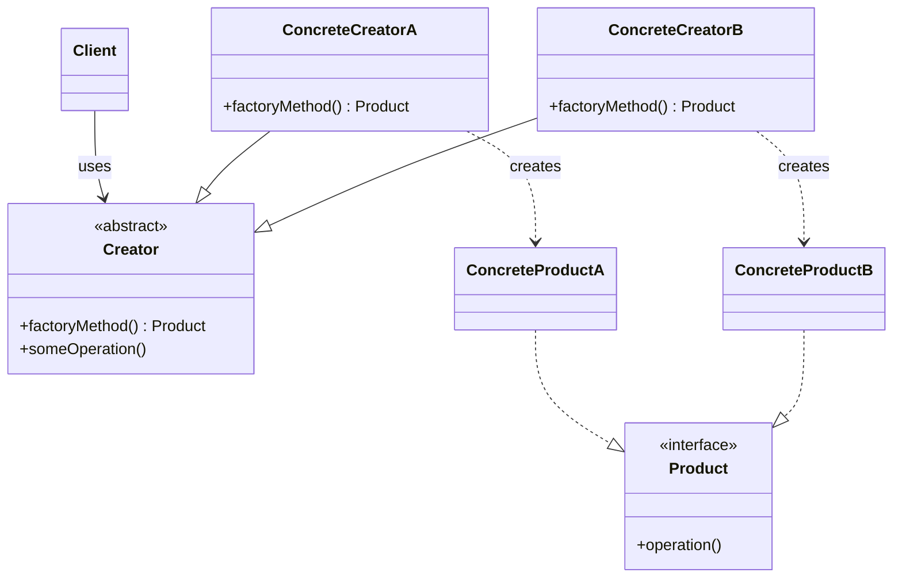
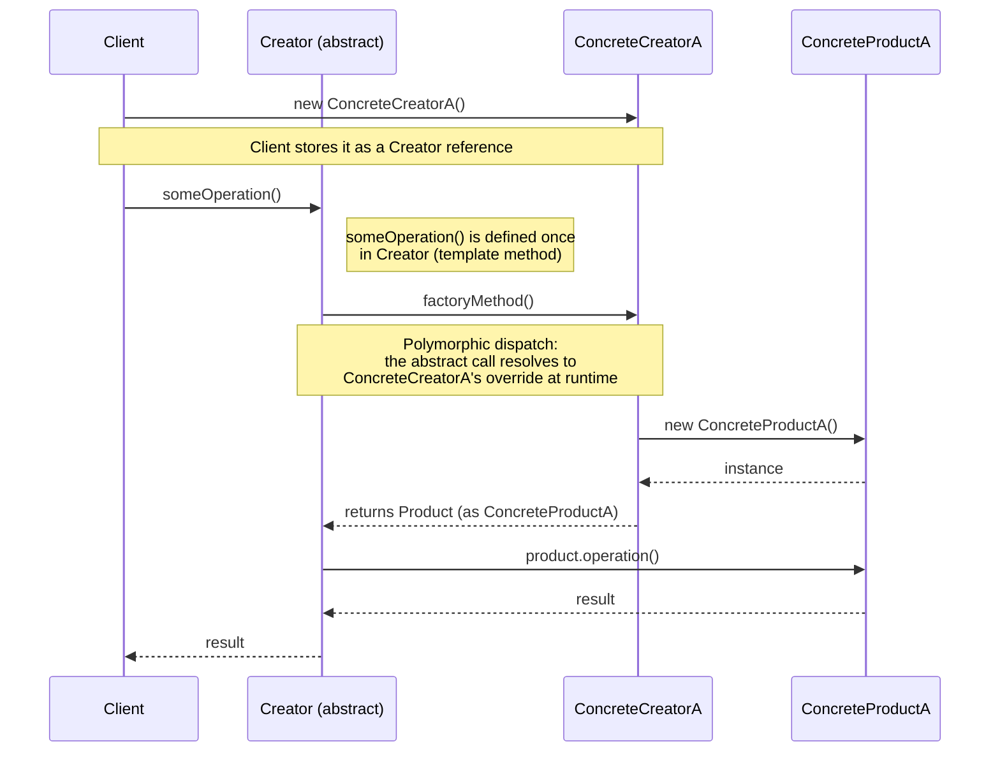

# Factory Pattern — Notes

## The Idea

**Factory Pattern = separate "creating an object" from "using an object."**

Without a factory, a service creates concrete classes directly:

```csharp
new BkashPayment()
new PayPalPayment()
```

→ tight coupling — the service has to know every concrete type.

With a factory, the service just asks for an abstraction:

```csharp
IPayment payment = factory.Create("bkash");
payment.Pay(100);
```

It never touches `new BkashPayment()` directly.

---

## Basic Structure

```csharp
// The abstraction
public interface IPayment
{
    void Pay(decimal amount);
}

// A concrete implementation
public class BkashPayment : IPayment
{
    public void Pay(decimal amount) => Console.WriteLine("Paid using bKash.");
}

// The factory
public class PaymentFactory
{
    public IPayment Create(string type) => type switch
    {
        "bkash" => new BkashPayment(),
        "creditcard" => new CreditCardPayment(),
        _ => throw new ArgumentException("Unsupported type.")
    };
}

// The consumer
public class PaymentService
{
    private readonly PaymentFactory _factory;
    public PaymentService(PaymentFactory factory) => _factory = factory;

    public void Process(string type, decimal amount) =>
        _factory.Create(type).Pay(amount);
}
```

---

## When to Use a Factory

Use it when:
- There are multiple implementations of something
- The right one is picked at **runtime**
- Creating the object is complex or repeated logic

Common examples: payment providers, notification senders, file parsers, report generators, database/storage providers.

**Don't** wrap simple, single-type objects in a factory just to avoid `new`:

```csharp
var calculator = new Calculator(); // fine — no factory needed
```

---

## Why It's Useful

| Principle | How Factory helps |
|---|---|
| **DIP** | `PaymentService` depends on `IPayment`, not on `BkashPayment` |
| **SRP** | Business logic and object creation live in separate classes |

---

## ⚠️ Factory ≠ Automatic OCP

A `switch` inside the factory still needs editing every time you add a new type:

```csharp
case "bkash": return new BkashPayment();
case "paypal": return new PayPalPayment(); // adding this = editing the factory
```

So: **a factory isolates creation, but doesn't automatically make it open/closed.**
To fix that, you'd move toward DI, a registration dictionary, or Strategy pattern.

---

## Simple Factory vs Factory Method

- **Simple Factory** — one class decides what to create (`factory.Create("bkash")`)
- **Factory Method** — subclasses decide what to create

**See the Example for Details understand**

---

## Mental Model

```
Consumer → Factory → Abstraction → Concrete A / B / C
```

- Factory owns **how it's created**
- Consumer owns **what it's used for**

---

## Key Takeaways

1. Factory separates creation from usage.
2. Depend on abstractions, not concrete classes.
3. Use a factory when creation varies or gets complex — not everywhere.
4. Factory alone doesn't guarantee OCP.

> **One-liner:** *Don't let business code decide how objects are created — delegate that to a Factory.*

# Dependency Graphs: Simple Factory vs Factory Method

## Simple Factory

A single factory class knows about *all* concrete products and decides which one to instantiate. The client depends on the factory, and the factory depends on every concrete product.



**Dependency direction:** `Client → SimpleFactory → {ConcreteProductA, ConcreteProductB}`
Adding a new product means **modifying** `SimpleFactory` (violates Open/Closed Principle).

### Sequence of a Typical Call



Note the extra `check type param` step inside `SimpleFactory` — it needs conditional logic (if/switch) to decide *which* concrete class to instantiate, since one class is responsible for all products.

---

## Factory Method

Each concrete creator is responsible for exactly one product. The client depends only on the abstract `Creator`, and each `ConcreteCreator` depends on its own `ConcreteProduct` — no single class knows about all products.



**Dependency direction:** `Client → Creator ← {ConcreteCreatorA, ConcreteCreatorB} → own Product only`
Adding a new product means **adding** a new `ConcreteCreator`/`ConcreteProduct` pair, no existing class is touched (follows Open/Closed Principle).

### Sequence of a Typical Call



**How to read this:**
1. The `Client` only ever creates a `ConcreteCreatorA`, but immediately treats it as a `Creator` — it never calls anything `ConcreteCreatorA`-specific again.
2. `someOperation()` (the "template method") lives in `Creator` and is written **once**, using `this.factoryMethod()` internally without knowing which concrete class it's running on.
3. At runtime, that call **polymorphically resolves** to `ConcreteCreatorA.factoryMethod()` — this is the core trick of the pattern: the abstract class calls a method it doesn't implement, and the concrete subclass supplies the missing piece.
4. No `if`/`switch` anywhere — swap in `ConcreteCreatorB` instead and the exact same `someOperation()` flow produces a `ConcreteProductB` instead, with zero code changes to `Creator`.

---

## Key Difference at a Glance

| Aspect | Simple Factory | Factory Method |
|---|---|---|
| Number of creator classes | 1 (concrete) | 1 abstract + N concrete |
| Who knows all products? | The single factory | No one — each creator knows only its own product |
| Extending with a new product | Modify existing factory | Add new subclass, no existing code touched |
| Coupling | Client → 1 concrete factory | Client → abstract creator only |
| Pattern category | Not a GoF pattern (idiom) | GoF Creational Pattern |