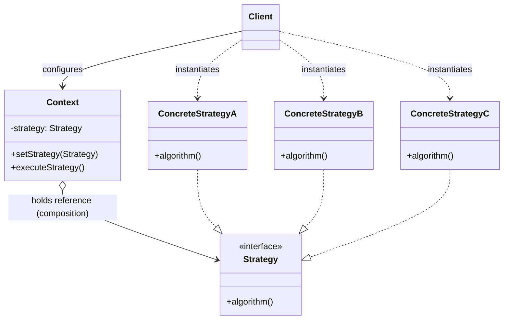
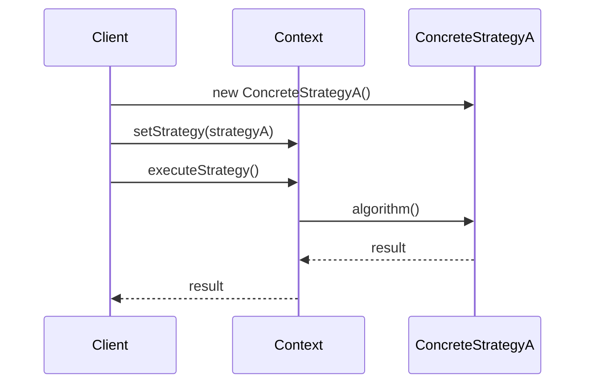

# Dependency Graph: Strategy Pattern

The `Context` holds a reference to a `Strategy` interface and delegates the algorithm to it at runtime. The `Client` is responsible for choosing which `ConcreteStrategy` to inject into the `Context` — the `Context` itself never depends on any concrete strategy.

**Dependency direction:** `Context → Strategy (interface only)`, `Client → {Context, ConcreteStrategy}`

- `Context` depends **only on the abstraction** (`Strategy`), never on any concrete strategy — this is what lets the algorithm be swapped at runtime.
- `Client` is the one that knows about concrete strategies, and wires the chosen one into `Context` (often via constructor or setter injection).
- Adding a new algorithm means adding a new `ConcreteStrategy` class — `Context` and `Strategy` are untouched (Open/Closed Principle).

---

## Sequence of a Typical Call

---

## How It Differs from Factory Method

| Aspect | Strategy | Factory Method |
|---|---|---|
| Purpose | Swap **behavior/algorithm** at runtime | Swap **which object gets created** |
| Who holds the reference | `Context` holds a `Strategy` field long-term | `Creator` produces a `Product`, often used once and returned |
| Relationship type | Composition (has-a, injected) | Creation (factory method returns new instance) |
| Client's role | Chooses and injects the strategy | Subclasses the creator to change the product |
| Category | GoF Behavioral Pattern | GoF Creational Pattern |