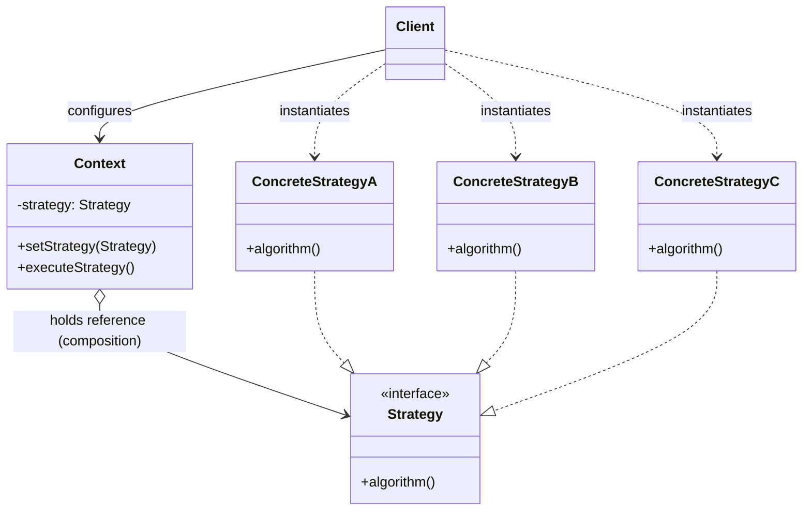
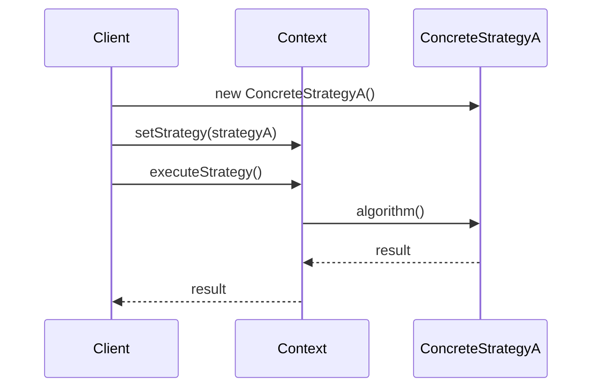

# Dependency Graph: Strategy Pattern

> **Strategy Pattern** = Put different ways of doing the same job into separate classes, then choose the behavior at runtime.

## The 3 Things to Remember

| # | Component | Role |
|---|-----------|------|
| 1 | **Strategy Interface** | Defines *what* can be done |
| 2 | **Concrete Strategies** | Define *how* it is done, differently |
| 3 | **Context** | Uses a strategy without knowing its internal details |

## When to Use It

Use Strategy when:

- You have multiple algorithms/behaviors for the same task.
- You see a growing `if/else` or `switch` based on behavior.
- You want to change behavior without modifying the main class.
- You want each behavior to be independently testable.

---

## ❌ Bad Example

Different payment methods handled inside one class:

```csharp
public class PaymentService
{
    public void Pay(string paymentType, decimal amount)
    {
        if (paymentType == "Card")
        {
            Console.WriteLine($"Paying {amount} using Card");
        }
        else if (paymentType == "Bkash")
        {
            Console.WriteLine($"Paying {amount} using Bkash");
        }
        else if (paymentType == "PayPal")
        {
            Console.WriteLine($"Paying {amount} using PayPal");
        }
    }
}
```

### Problem

Every time we add a payment method, we have to **modify** `PaymentService`.

```
PaymentService
     |
     +-- Card
     +-- Bkash
     +-- PayPal
     +-- New payment...
```

The class becomes responsible for knowing about *every* payment algorithm — a violation of the Open/Closed Principle.

---

## ✅ Good Example — Strategy Pattern

### 1. Strategy (Interface)

```csharp
public interface IPaymentStrategy
{
    void Pay(decimal amount);
}
```

### 2. Concrete Strategies

```csharp
public class CardPayment : IPaymentStrategy
{
    public void Pay(decimal amount)
    {
        Console.WriteLine($"Paying {amount} using Card");
    }
}

public class BkashPayment : IPaymentStrategy
{
    public void Pay(decimal amount)
    {
        Console.WriteLine($"Paying {amount} using Bkash");
    }
}

public class PayPalPayment : IPaymentStrategy
{
    public void Pay(decimal amount)
    {
        Console.WriteLine($"Paying {amount} using PayPal");
    }
}
```

### 3. Context

```csharp
public class PaymentService
{
    private readonly IPaymentStrategy _paymentStrategy;

    public PaymentService(IPaymentStrategy paymentStrategy)
    {
        _paymentStrategy = paymentStrategy;
    }

    public void Pay(decimal amount)
    {
        _paymentStrategy.Pay(amount);
    }
}
```

### Usage

```csharp
var payment = new PaymentService(new BkashPayment());
payment.Pay(1000);
```

Want Card instead? Just swap the strategy — no changes to `PaymentService`:

```csharp
var payment = new PaymentService(new CardPayment());
payment.Pay(1000);
```

---

## Mental Model

```
                IPaymentStrategy
                       |
          +------------+------------+
          |            |            |
        Card         Bkash        PayPal
          |            |            |
          +------------+------------+
                       |
                PaymentService
                   (Context)
```

**Key idea:** `PaymentService` doesn't care *how* payment happens. It only knows that a payment strategy can `Pay()`.

---

## Strategy vs Factory

They solve **different problems**:

| Pattern | Main Question |
|---------|---------------|
| **Factory** | "Which object should I create?" |
| **Strategy** | "Which behavior/algorithm should I use?" |

They're also commonly used **together**:

```
Factory
   ↓
Creates Strategy
   ↓
PaymentService
   ↓
Uses Strategy
```

---

## 80/20 Takeaway

> **Strategy Pattern removes behavior-selection logic from a class by encapsulating each behavior behind a common interface.**

The `Context` holds a reference to a `Strategy` interface and delegates the algorithm to it at runtime. The `Client` is responsible for choosing which `ConcreteStrategy` to inject into the `Context` — the `Context` itself never depends on any concrete strategy.



**Dependency direction:** `Context → Strategy (interface only)`, `Client → {Context, ConcreteStrategy}`

- `Context` depends **only on the abstraction** (`Strategy`), never on any concrete strategy — this is what lets the algorithm be swapped at runtime.
- `Client` is the one that knows about concrete strategies, and wires the chosen one into `Context` (often via constructor or setter injection).
- Adding a new algorithm means adding a new `ConcreteStrategy` class — `Context` and `Strategy` are untouched (Open/Closed Principle).

---

## Sequence of a Typical Call



---

## How It Differs from Factory Method

| Aspect | Strategy | Factory Method |
|---|---|---|
| Purpose | Swap **behavior/algorithm** at runtime | Swap **which object gets created** |
| Who holds the reference | `Context` holds a `Strategy` field long-term | `Creator` produces a `Product`, often used once and returned |
| Relationship type | Composition (has-a, injected) | Creation (factory method returns new instance) |
| Client's role | Chooses and injects the strategy | Subclasses the creator to change the product |
| Category | GoF Behavioral Pattern | GoF Creational Pattern |