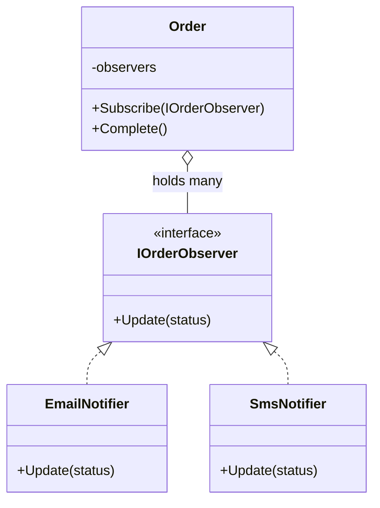
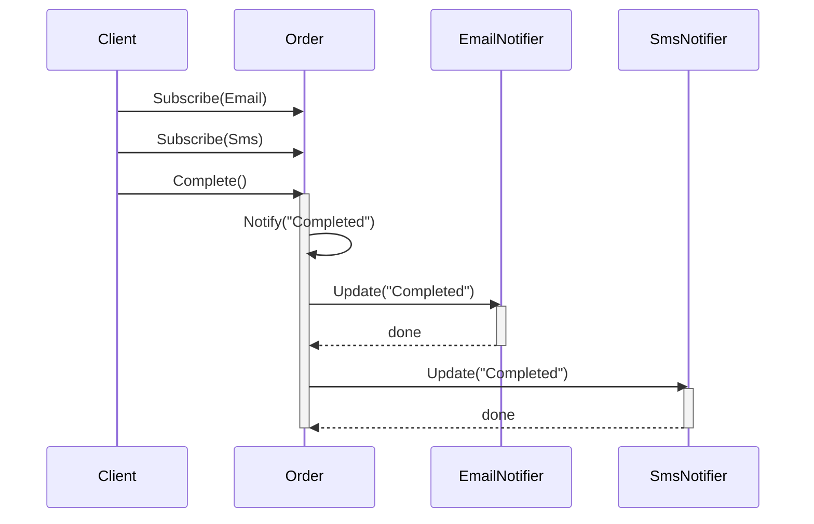

# Observer Pattern

## Core idea

One object (the **Subject**) notifies multiple dependent objects (**Observers**) automatically when its state changes. The subject doesn't know or care what the observers do with that notification.

## 1. The problem (without Observer)

```csharp
public class OrderService
{
    public void CompleteOrder()
    {
        SendEmail();
        SendSms();
        UpdateLogger();
    }
    private void SendEmail() { }
    private void SendSms() { }
    private void UpdateLogger() { }
}
```

`OrderService` is tightly coupled to every channel. Adding a new one means editing this class.

## 2. The Observer solution

```csharp
public interface IOrderObserver
{
    void Update(string status);
}

public class EmailNotifier : IOrderObserver
{
    public void Update(string status) => Console.WriteLine($"Email: {status}");
}

public class Order
{
    private readonly List<IOrderObserver> _observers = new();

    public void Subscribe(IOrderObserver o) => _observers.Add(o);
    public void Unsubscribe(IOrderObserver o) => _observers.Remove(o);

    public void Complete()
    {
        Console.WriteLine("Order completed.");
        foreach (var o in _observers) o.Update("Completed");
    }
}

// Usage
var order = new Order();
order.Subscribe(new EmailNotifier());
order.Complete();
```

## 3. Dependency graph



`Order` depends only on `IOrderObserver`, never on `EmailNotifier` or `SmsNotifier` directly — that inversion is the whole point.

## 4. Sequence diagram



`Notify` is synchronous — `Order` blocks on each `Update()` in turn, so a slow observer delays the rest.

## 5. Roles, benefit, pitfall

- **Subject** = `Order`. **Observer** = `EmailNotifier`, `SmsNotifier`. **Notification** = the `status` payload.
- Benefit: one-to-many dependency with loose coupling — subject depends on an abstraction, not concrete classes.
- Pitfall: forgetting `Unsubscribe()` leaks memory and can throw on dead references.

## 6. When to use it

Use it when one state change must reach several objects, the subject shouldn't need to know who's listening, or new consumers will be added later. Skip it for a single fixed listener, or when observers must run in a strict guaranteed order.

## 80/20 summary

Observer = "When I change, notify everyone interested — without knowing who they are."

## One-line interview answer

Observer Pattern defines a one-to-many dependency where a subject notifies multiple observers automatically on state change, without knowing their concrete types.