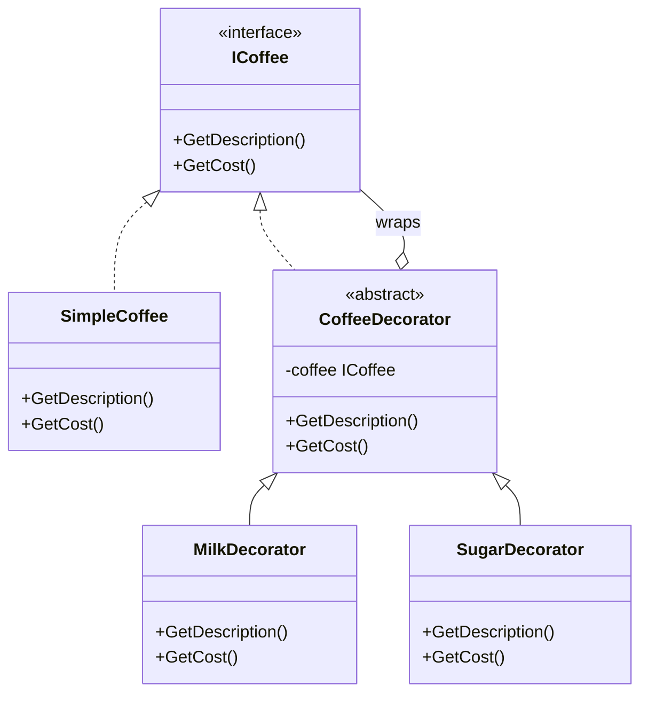
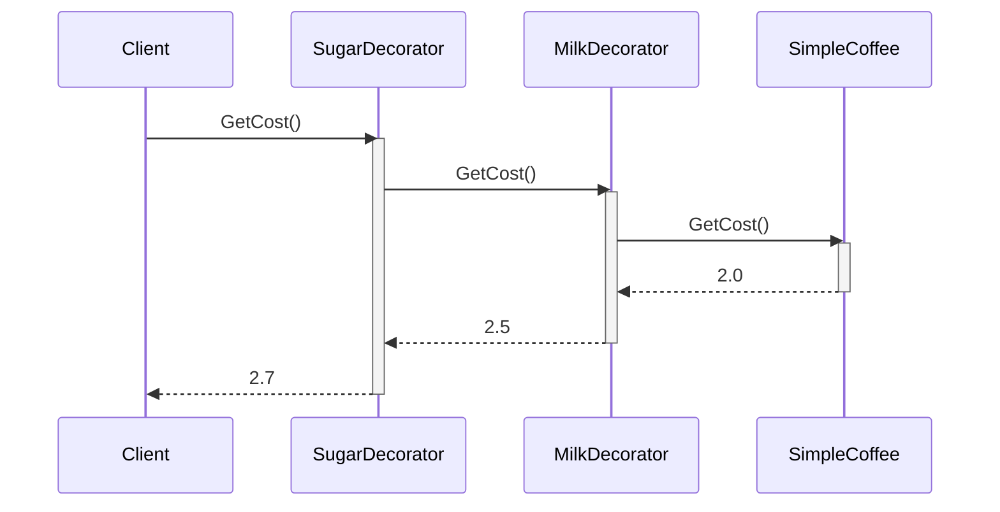

# Decorator Pattern

## Core idea

Attach new behavior to an object at runtime by wrapping it in another object that shares the same interface. No subclassing, no touching the original class.

### 1. When to Use It

Use Decorator when:

- You need to add optional behavior.
- You want to combine multiple behaviors.
- You don't want to modify the original class.
- Inheritance would create too many subclasses.

Example:
```
Coffee
 └── Milk
      └── Sugar
           └── WhippedCream
```

## 1. The problem (without Decorator)

```csharp
public class Coffee { }
public class CoffeeWithMilk { }
public class CoffeeWithSugar { }
public class CoffeeWithMilkAndSugar { }
public class CoffeeWithMilkSugarAndWhip { }
```

Every combination of add-ons needs its own subclass. N options → up to 2^N classes.

## 2. The Decorator solution

```csharp
public interface ICoffee
{
    string GetDescription();
    double GetCost();
}

public class SimpleCoffee : ICoffee
{
    public string GetDescription() => "Coffee";
    public double GetCost() => 2.0;
}

public abstract class CoffeeDecorator : ICoffee
{
    protected readonly ICoffee _coffee;
    protected CoffeeDecorator(ICoffee coffee) => _coffee = coffee;
    public virtual string GetDescription() => _coffee.GetDescription();
    public virtual double GetCost() => _coffee.GetCost();
}

public class MilkDecorator : CoffeeDecorator
{
    public MilkDecorator(ICoffee coffee) : base(coffee) { }
    public override string GetDescription() => base.GetDescription() + " + Milk";
    public override double GetCost() => base.GetCost() + 0.5;
}

public class SugarDecorator : CoffeeDecorator
{
    public SugarDecorator(ICoffee coffee) : base(coffee) { }
    public override string GetDescription() => base.GetDescription() + " + Sugar";
    public override double GetCost() => base.GetCost() + 0.2;
}

// Usage
ICoffee coffee = new SugarDecorator(new MilkDecorator(new SimpleCoffee()));
Console.WriteLine(coffee.GetDescription()); // Coffee + Milk + Sugar
Console.WriteLine(coffee.GetCost());        // 2.7
```

## 3. Dependency graph



`CoffeeDecorator` implements `ICoffee` *and* holds a reference to an `ICoffee` — that's what lets decorators stack on each other or on the real object, indistinguishably.

## 4. Sequence diagram



The call cascades inward through every wrapper to the real object, then each decorator adds its bit on the way back out. Order of wrapping = order the add-ons apply.

## 5. Roles, benefit, pitfall

- **Component** = `ICoffee`. **Concrete component** = `SimpleCoffee`. **Decorator** = `CoffeeDecorator` and its subclasses.
- Benefit: behavior is composed at runtime, not fixed at compile time via subclassing — mix and match freely.
- Pitfall: deep decorator stacks get hard to debug (a stack trace of five wrappers), and decorators must strictly preserve the component's interface or callers break.

## 6. When to use it

Use it when you need to add responsibilities to individual objects (not the whole class) without subclass explosion, or when the set of add-ons is open-ended. Skip it when there are only one or two fixed variants — a couple of subclasses or a config flag is simpler.

## 80/20 summary

Decorator = "Wrap it, don't extend it — stack behavior at runtime."

## One-line interview answer

Decorator Pattern lets you attach new behavior to an object dynamically by wrapping it in decorator objects that implement the same interface, avoiding subclass explosion.