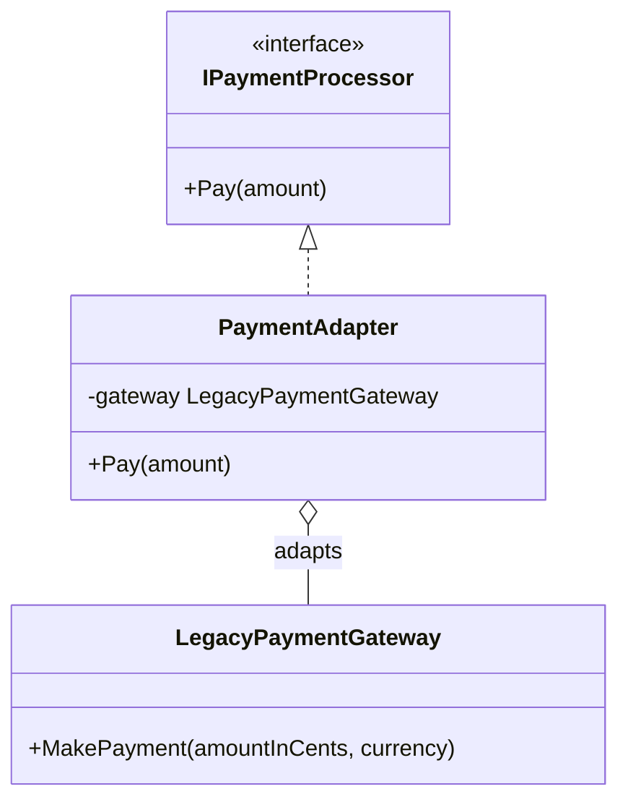
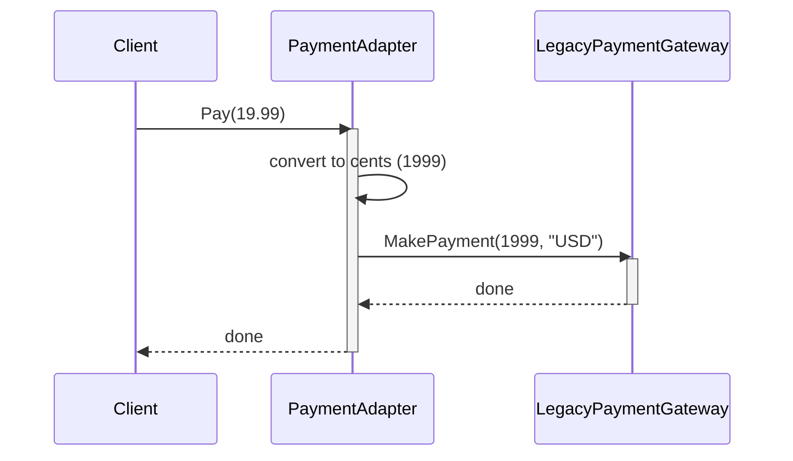

# Adapter Pattern

## Core idea

Convert the interface a class actually has into the interface a client expects, by wrapping it. Lets two incompatible interfaces work together without modifying either one.

## 1. The problem (without Adapter)

```csharp
public interface IPaymentProcessor
{
    void Pay(double amount);
}

// Third-party SDK you can't change — different signature entirely
public class LegacyPaymentGateway
{
    public void MakePayment(int amountInCents, string currency) { }
}
```

Your app expects `Pay(double amount)`. The vendor library expects `MakePayment(int cents, string currency)`. You can't edit the vendor code, and you don't want vendor-specific calls scattered through your app.

## 2. The Adapter solution

```csharp
public class PaymentAdapter : IPaymentProcessor
{
    private readonly LegacyPaymentGateway _gateway;
    public PaymentAdapter(LegacyPaymentGateway gateway) => _gateway = gateway;

    public void Pay(double amount)
    {
        int cents = (int)(amount * 100);
        _gateway.MakePayment(cents, "USD");
    }
}

// Usage
IPaymentProcessor processor = new PaymentAdapter(new LegacyPaymentGateway());
processor.Pay(19.99);
```

The rest of the app only ever talks to `IPaymentProcessor`. It has no idea a legacy gateway is behind it.

## 3. Dependency graph



`PaymentAdapter` is the only class that knows both interfaces exist. The client depends on `IPaymentProcessor`; `LegacyPaymentGateway` stays completely untouched.

## 4. Sequence diagram



One call in, one translated call out — the adapter's whole job is the conversion step in the middle.

## 5. Roles, benefit, pitfall

- **Target** = `IPaymentProcessor` (what the client wants). **Adaptee** = `LegacyPaymentGateway` (what actually exists). **Adapter** = `PaymentAdapter` (the translator).
- Benefit: incompatible code integrates with zero changes to either side — common for third-party SDKs, legacy modules, or swapping vendors later.
- Pitfall: stacking adapters on adapters hides what's really happening at runtime; keep the translation layer thin and single-purpose.

## 6. When to use it

Use it when you need to integrate an existing class (legacy code, a third-party library) whose interface doesn't match what your code expects, and you can't or shouldn't modify either side. Skip it if you *can* just change one of the interfaces directly — that's simpler than adding a wrapper.

## 80/20 summary

Adapter = "Translate one interface into another so incompatible code can talk."

## One-line interview answer

Adapter Pattern converts an existing class's interface into the interface a client expects, letting otherwise incompatible classes work together without modifying either.